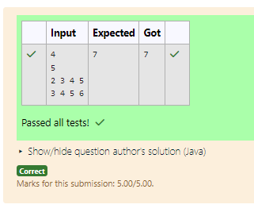

# EX 5A 0/1 Knapsack Problem - Branch&Bound 

## AIM:
To Write a Java program to solve 0/1 Knapsack problem using Branch and Bound Approach.
You are heading a college entrepreneurship cell that can invest in up to N student‑startups.

For each startup i you know: cost[i]  — the amount (in ₹ lakh) required to join the showcase profit[i] — the estimated profit (in ₹ lakh) you’ll gain if it succeeds You have a total budget of B ₹ lakh. Pick a subset of startups so that the sum of costs ≤ B and the sum of profits is maximised.

Because N can be as large as 50, a plain exhaustive search (2^N) is too slow.

The recommended approach is Branch & Bound with a fractional‑knapsack upper bound (but any algorithm that meets the constraints is accepted). 

Input Format

N

B

cost[1] cost[2] … cost[N]

profit[1] profit[2] … profit[N]

1 ≤ N ≤ 50

1 ≤ B ≤ 1 000 000

1 ≤ cost[i], profit[i] ≤ 10 000 

Output Format

maxProfit

## Algorithm
1. Read the number of items (N), capacity (B), and arrays of cost and profit.

2. Sort items based on profit-to-cost ratio in descending order to improve bounding efficiency.

3. Define a bound function to estimate the maximum possible profit from a given state using fractional knapsack logic.

4. Use DFS (Branch and Bound):
   - At each item, decide to include or exclude it.
   - Prune branches where the bound is less than or equal to current best profit.

5. Track and update the maximum profit (best) and print the final result.

## Program:
```java
/*
Program to solve the 0/1 Knapsack problem using Branch and Bound technique
Developed by: Junaid Sardar S
Register Number: 212224100028 
*/

import java.util.*;
public class StartupShowcaseOptimizer {
    static int N, B;
    static int[] c, p;          
    static int best = 0;        
    static double bound(int idx, int cw, int cv) {
        if (cw >= B) return cv;                 
        double val = cv;
        int rem = B - cw;

        while (idx < N && c[idx] <= rem) {      
            rem -= c[idx];
            val += p[idx];
            idx++;
        }
        if (idx < N) val += p[idx] * (rem / (double) c[idx]); 
        return val;
    }
    static void dfs(int idx, int cw, int cv) {
        if (idx == N) {                
            best = Math.max(best, cv);
            return;
        }
        if (bound(idx, cw, cv) <= best) return; 
        if (cw + c[idx] <= B)
            dfs(idx + 1, cw + c[idx], cv + p[idx]);
        dfs(idx + 1, cw, cv);
    }
    public static void main(String[] args) {
        Scanner sc = new Scanner(System.in);
        N = sc.nextInt();
        B = sc.nextInt();
        int[] cost = new int[N];
        int[] prof = new int[N];
        for (int i = 0; i < N; i++) cost[i] = sc.nextInt();
        for (int i = 0; i < N; i++) prof[i] = sc.nextInt();
        sc.close();
        Integer[] idx = new Integer[N];
        Arrays.setAll(idx, i -> i);
        Arrays.sort(idx, Comparator.comparingDouble(i -> -(double) prof[i] / cost[i]));
        c = new int[N];
        p = new int[N];
        for (int i = 0; i < N; i++) {
            c[i] = cost[idx[i]];
            p[i] = prof[idx[i]];
        }
        dfs(0, 0, 0);
        System.out.println(best);
    }
}
```

## Output:


## Result:
The program successfully solved 0/1 Knapsack problem using branch & bound and output is verified. 
