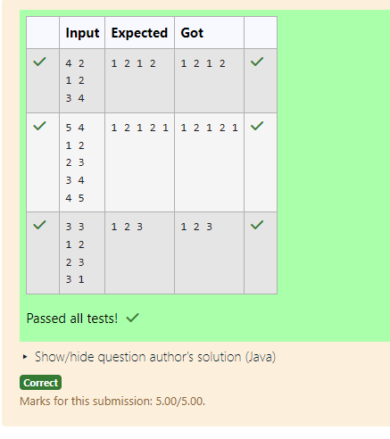

# EX 5D Flower Planting.

## AIM:
To write a Java program to for given constraints.
You are given n gardens, labelled from 1 to n.

You also have a list called paths, where each element paths[i] = [xi, yi] represents a bidirectional road connectingthe  garden xi and garden yi.

You want to plant one flower in each garden, and there are exactly 4 types of flowers labelled as 1, 2, 3, and 4.

Your goal is to plant flowers such that:

No two connected gardens (i.e., connected via a path) have the same flower type.

Return any valid flower assignment as an array where:

answer[i] is the flower type planted in the (i+1) ᵗʰ garden

It is guaranteed that:

No garden is connected to more than 3 other gardens

A valid flower assignment always exists


## Algorithm
1. Read the number of gardens (n) and paths (edges) between gardens.

2. Create an adjacency list to represent connections between gardens.

3. Initialize a result array to store flower types for each garden.

4. For each garden:
   - Check the flower types of its neighboring gardens.
   - Mark those flower types as used.

5. Assign the smallest available flower type (1 to 4) that is not used by neighbors and store it in the result array.   

## Program:
```java
/*
Program to assign flower types to gardens such that no adjacent gardens have the same type
Developed by: Junaid Sardar S
Register Number: 212224100028 
*/

import java.util.*;
public class GardenFlowerPlanner {
    public static int[] assignFlowers(int n, int[][] paths) {
        @SuppressWarnings("unchecked")
        List<Integer>[] adj = new ArrayList[n];
        for (int i = 0; i < n; i++) {
            adj[i] = new ArrayList<>();
        }
        for (int[] path : paths) {
            int a = path[0] - 1;
            int b = path[1] - 1;
            adj[a].add(b);
            adj[b].add(a);
        }
        int[] result = new int[n]; // answer[i] is the flower type of garden i+1
        for (int i = 0; i < n; i++) {
            boolean[] used = new boolean[5]; // flowers 1 to 4
            for (int neighbor : adj[i]) {
                int flower = result[neighbor];
                if (flower != 0) {
                    used[flower] = true;
                }
            }
            for (int flower = 1; flower <= 4; flower++) {
                if (!used[flower]) {
                    result[i] = flower;
                    break;
                }
            }
        }
        return result;
    }
    public static void main(String[] args) {
        Scanner sc = new Scanner(System.in);
        int n = sc.nextInt(); // number of gardens
        int m = sc.nextInt(); // number of paths
        int[][] paths = new int[m][2];
        for (int i = 0; i < m; i++) {
            paths[i][0] = sc.nextInt();
            paths[i][1] = sc.nextInt();
        }
        int[] result = assignFlowers(n, paths);
        for (int flower : result) {
            System.out.print(flower + " ");
        }
        System.out.println();
    }
}
```

## Output:


## Result:
The program successfully implemented and the expected output is verified.
