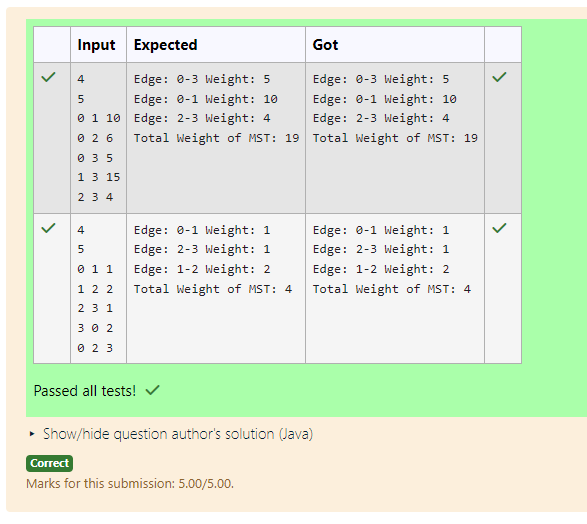

# EX 5E Minimum Spanning Tree -Boruvka's Algorithm

## AIM:
To write a Java program to for given constraints.
Boruvka's Algorithm - Minimum Spanning Tree

Find the MST using Boruvka's Algorithm for a weighted undirected graph.


## Algorithm
1. Read the number of vertices (V) and edges (E), and store all edges with their weights.

2. Initialize each vertex as a separate component using a parent array (Disjoint Set).

3. While there is more than one component:
   - For each component, find the cheapest edge connecting it to another component.

4. Add the selected cheapest edges to the MST:
   - Perform union of the two components.
   - Update the total MST weight and reduce the number of components.

5. Repeat until only one component remains, then output the total weight of the MST.

## Program:
```java
/*
Program to find the Minimum Spanning Tree using Boruvka's algorithm
Developed by: Junaid Sardar S
Register Number: 212224100028 
*/

import java.util.*;
public class BoruvkaMST {
    static int[] parent;
    static int find(int i) {
        if (parent[i] != i)
            parent[i] = find(parent[i]);
        return parent[i];
    }
    static void union(int x, int y) {
        parent[find(x)] = find(y);
    }
    static int boruvkaMST(int V, List<Edge> edges) {
        parent = new int[V];
        for (int i = 0; i < V; i++) parent[i] = i;
        int components = V;
        int mstWeight = 0;
        while (components > 1) {
            Edge[] cheapest = new Edge[V];
            for (Edge e : edges) {
                int set1 = find(e.src), set2 = find(e.dest);
                if (set1 == set2) continue;
                if (cheapest[set1] == null || cheapest[set1].weight > e.weight)
                    cheapest[set1] = e;
                if (cheapest[set2] == null || cheapest[set2].weight > e.weight)
                    cheapest[set2] = e;
            }
            for (int i = 0; i < V; i++) {
                Edge e = cheapest[i];
                if (e != null && find(e.src) != find(e.dest)) {
                    mstWeight += e.weight;
                    union(e.src, e.dest);
                    components--;
                    System.out.println("Edge: " + e.src + "-" + e.dest + " Weight: " + e.weight);
                }
            }
        }
        return mstWeight;
    }
    public static void main(String[] args) {
        Scanner sc = new Scanner(System.in);
        int V = sc.nextInt();
        int E = sc.nextInt();
        List<Edge> edges = new ArrayList<>();
        for (int i = 0; i < E; i++) {
            edges.add(new Edge(sc.nextInt(), sc.nextInt(), sc.nextInt()));
        }
        int totalWeight = boruvkaMST(V, edges);
        System.out.println("Total Weight of MST: " + totalWeight);
        sc.close();
    }
}
class Edge {
    int src, dest, weight;
    Edge(int s, int d, int w) {
        src = s; dest = d; weight = w;
    }
}
```

## Output:


## Result:
The program successfully implemented and the expected output is verified.
